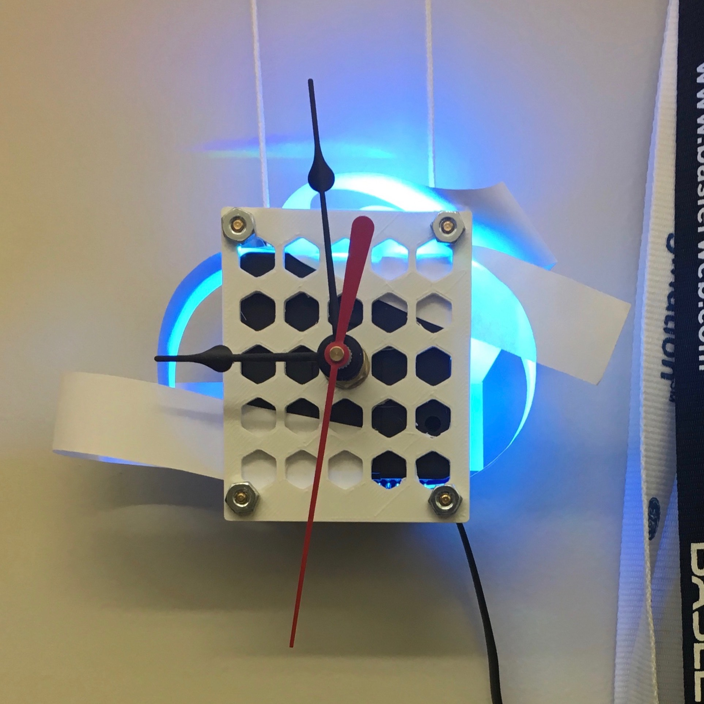
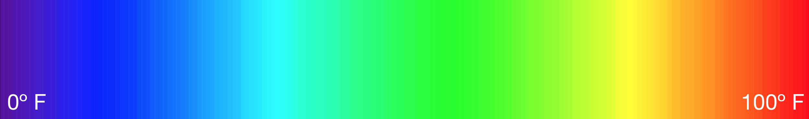

# weatherclock

I wanted to build an aesthetically pleasing analog clock with a touch of simple electronics and a lightweight app that would allow me to check the current time and weather with just a glance, whether I'm next to it, across the room, half-awake, etc. I'm a bit backwards and don't entirely believe screens are needed in all our smart devices.



### Functionality
Time is displayed with an analog clock. Weather is displayed with RGB LEDs. Different colors are achieved by varying the intensities on the LEDs. The color displayed by the LEDs is mapped linearly from 0 degrees Fahrenheit (violet) to 100 degrees Fahrenheit (red). Additionally, the breathing/pulsing pattern of the LED will display conditions, such as cloudy, rainy, etc.



### Implementation:

This is an IoT project through and through. There's three major components to this project. There's the analog part which is the physical object itself. There's the electronics that bridge the gap between physical and digital. And then there's the server that sits in the cloud and retrieves and processes weather data.

###### The Clock
The clock is a traditional battery powered quartz movement with hands for seconds, minutes, and hours. The physical appearance of the clock is still in flux. Currently, I'm thinking of weaving together some light but rigid diffusive material to form some sort of structure to mount the clock and electronics to. The main goal of this structure is to back reflect and diffuse the light from the LEDs creating a soft glow that's easy on the eyes.

###### Electronics
For the microprocessor, I wanted something wireless, small, simple, but powerful. Nimble! The Particle Photon fits the bill. It's got a 3.3V logic microprocessor that uses the wiring/Arduino environment, a Broadcom WiFi chip for wireless communication, and it's tiny! The Particle Cloud also abstracts much of the networking to a simple to use REST API. Granted, all of this can easily be done on the Raspberry Pi, however the Photon has a much smaller form package and the Raspberry Pi is overkill for such a single-minded process. A rechargeable 3.7V LiPoly battery powers the electronics, which includes LEDs to provide visualization of the weather. Currently, I'm just using the onboard RGB LED on the Photon but will probably switch to either the Neopixels or the CREE MC-E.

###### Application
Similar to the microprocessor, I wanted a nimble server. I decided to go with a Node.js server because the weather data I wanted to use from Dark Sky, which I've heard good things about, was provided in JSON format. Node.js handles that well in addition to being a lightweight and efficient server. The Node.js server periodically requests weather data, parses it, and then forwards it to Particle Cloud, which in turn is relied to the Photon. The Node.js server is deployed on Heroku.

### Running:

###### server.js
Install dependencies listed in package.json and then run.

```
npm install
node server.js
```

If you are running the server locally, you will need to create a .env file that contains your secrete keys and parameters for Dark Sky and Particle.

```
# Secret sauce to the weatherclock

APIKEY=your-darksky-apikey
LAT=your-latitude
LONG=your-longitude
DEVICEID=your-photon-id
ACCESSTOKEN=your-particle-access-token
```
And if you're deploying on heroku, just add those keys to the Config Variables in the settings option of your app. I also set up a Procfile to run the server as a worker dyno so the server doesn't sleep. See links below on deploying to Heroku.

###### device.ino
This is the code that goes on the Photon. You can compile and flash using the web or local IDE provided by Particle -- it's pretty intuitive. Or you can compile and flash using the Command Line Interface (CLI), which is my preference. You'll need to download CLI and dfu-util first. And make sure the photon is in dfu mode before flashing.

```
$ particle compile photon device.ino breathe.h breathe.cpp --saveTo firmware.bin
$ particle flash --usb firmware.bin
```

### Reference Links:

Weather data powered by Dark Sky: https://darksky.net/dev/docs

Particle Photon:
* Basic guide: https://docs.particle.io/guide/getting-started/intro/photon/
* Firmware: https://docs.particle.io/reference/firmware/photon/
* Datasheet: https://docs.particle.io/datasheets/photon-datasheet/
* Command Line Interface (CLI): https://docs.particle.io/reference/cli/
* Particle Cloud: https://docs.particle.io/reference/api/

Node.js and Modules:
* Node.js: https://nodejs.org/en/
* Request: https://www.npmjs.com/package/request
* Dotenv: https://www.npmjs.com/package/dotenv
* Particle API JS: https://docs.particle.io/reference/javascript/

Heroku:
* Deploying using git: https://devcenter.heroku.com/articles/git
* Deploying Node.js: https://devcenter.heroku.com/articles/deploying-nodejs
* Using environmental variables: https://devcenter.heroku.com/articles/config-vars
* Dynos: https://devcenter.heroku.com/articles/dynos

Neopixels:
* Guide: https://learn.adafruit.com/adafruit-neopixel-uberguide/overview
